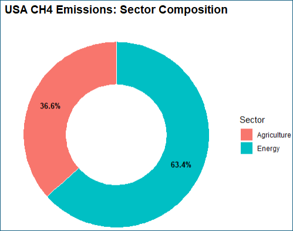
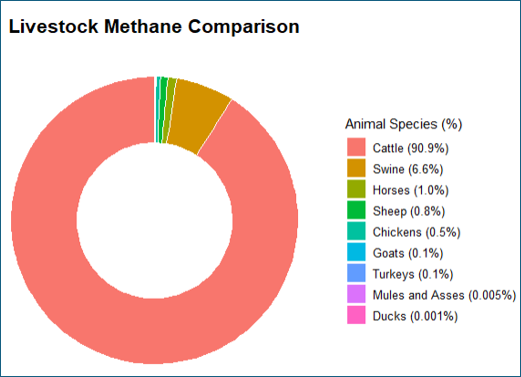
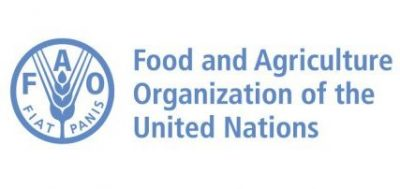
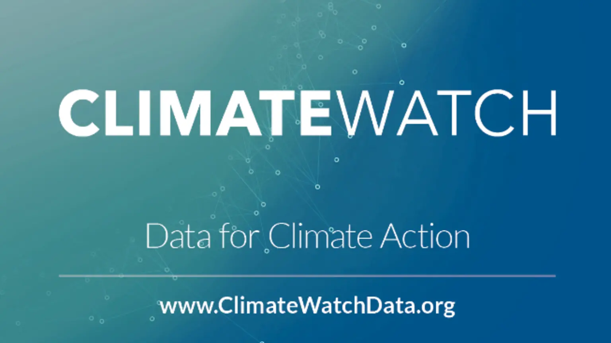
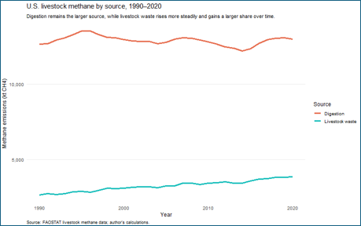
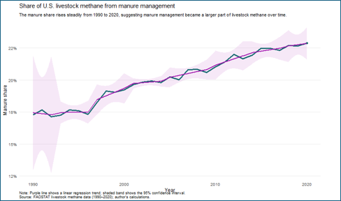
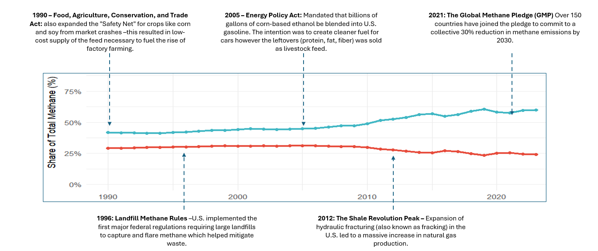

# Emissions Impossible: The Methane Crisis Driven by Factory Farming

Methane from industrial animal agriculture is a tremendous climate issue in the United States because livestock systems release large amounts of methane through **enteric fermentation** and **manure management**, and those emissions remain an impactful share of national methane output.[1][2] In the United States, agriculture is one of the largest methane-emitting sectors, and livestock production drives that footprint because cattle, dairy operations, and large-scale swine systems produce methane continuously as part of both digestion and waste handling.[1][

## Overview

Factory farming, often associated with concentrated animal feeding operations, has transformed meat and dairy production by maximizing output through confinement, selective breeding, specialized feed, and centralized waste systems. That model has lowered production costs and expanded national supply chains, but it has also concentrated environmental harm in the form of manure lagoons, air pollution, water contamination, and rising methane emissions from dense livestock populations.[3][4] 

Methane matters because it is a potent greenhouse gas. The U.S. Environmental Protection Agency explains that methane is emitted from agriculture, energy systems, landfills, and natural processes, and that reducing methane is critical because cutting short-lived climate pollutants can slow climate change more rapidly than relying only on long-term carbon dioxide reductions.[1] This makes agricultural methane a policy priority. 

## Methane in animal agriculture

Two sources account for most of the livestock methane emissions. The first is **enteric fermentation**, a digestive process in ruminant animals (cattle, sheep, and goats) that produces methane as microbes break down fibrous feed in low-oxygen conditions.[1][5] The second is **manure management**, when manure is stored in liquid systems (lagoons or holding tanks), where anaerobic decomposition produces methane over time as a byproduct of breaking down waste.[1][4] 

These two mechanisms matter because they reflect two different features of the same industrial system. Enteric methane is related to herd size, species, and feeding patterns, while manure methane is  influenced by confinement, storage practices and waste concentration.[2][4] As livestock production has become more centralized and intensive, manure management has become a larger source of methane, especially in large dairy and swine operations.[3][4] 

The livestock in these industrial systems will impact methane emissions. Cattle are the dominant livestock source of methane because they are ruminants and because the U.S. cattle and dairy industries operate at very large scale. Swine contribute less methane through digestion, but they can generate large amounts of methane through manure lagoons, which is a common practice.[1][4] 

## Data sources

This analysis is best grounded in official and widely used data systems. For U.S. methane trends, the most reliable source is the EPA greenhouse gas inventory which includes the EPA methane overview and the U.S. gridded methane emissions dataset, both of which summarize emissions by sector and source category.[1][2] These sources are useful because they provide consistent national accounting and a direct explanation of how methane is measured across agriculture, energy, waste, and other sectors.[1][2] 

For agricultural breakdowns by livestock category and process, FAOSTAT is a complementary source because it tracks emissions from enteric fermentation and manure management across countries and years using IPCC-aligned estimation methods.[6] Climate Watch is also useful for comparing sector shares over time and situating U.S. agriculture within the broader methane profile of the economy, although official EPA sources should remain the primary reference when discussing U.S. national totals.[2] 

These datasets are reliable, but they also have limitations. EPA and FAOSTAT inventories often rely on estimation methods rather than direct measurement at each farm, and those estimates may not fully capture farm-level variation in feed additives, manure handling changes, regional climate conditions, or new technologies.[2][6] This means the broad trend lines are strong enough for policy analysis, but the numbers should still be interpreted as inventory-based estimates rather than perfect measurements.[2] 

## Historical trends

Across the last several decades, livestock methane has remained a key part of the U.S. emissions profile even as other sectors have experienced change. EPA data shows that agriculture continues to be a large methane source in the United States, and livestock remains central to that category because enteric fermentation and manure management both produce recurring emissions every year.[1][2] This is one reason factory farming deserves attention in climate policy discussions. 

At the same time, the composition of livestock methane has been shifting. Enteric fermentation has historically remained the larger source, particularly because of cattle, but manure management has grown in significance as more livestock are raised in confined systems that rely on liquid waste storage.[3][4] This matters because it suggests that industrial production methods have not just maintained methane emissions; they have altered the structure of those emissions in ways tied directly to scale and confinement.[3] 

{width=100% fig-align="center"}

The rise in manure methane is particularly important in dairy and swine systems. Research and policy discussions around digesters, lagoon management, and manure capture all exist because these  systems generate methane at levels that are significantly different from smaller, dispersed, or drier waste systems.[4][7] The problem is not only how many animals exist, but also how industrial infrastructure handles the waste that is produced.[4] 

{width=100% fig-align="center"}

## Economic and technological drivers

The growth of factory farming was able to happen given technological innovations such as improved genetics, specialized feed, antibiotics, mechanized processing, and systems that made it easier to raise more animals in less space and move animal products across the nation at a lower cost.[3][4] These innovations increased efficiency , but they also reinforced a production model that concentrates methane-generating waste.[3] 
Economic incentives have been another contributor. Federal agricultural policy, feed crop subsidies, energy policy, and rural development incentives helped make industrial livestock systems economically resilient, especially when paired with strong consumer demand for beef, dairy, and pork.[4][8] When production is rewarded primarily for volume and efficiency, environmental impact such as methane takes a back seat. 

Manure digesters are a complicated policy issue. Digesters can capture methane and convert it into biogas, which sounds environmentally beneficial, but analysts have warned that digester subsidies also reinforce the economic model of very large confined operations by making concentrated manure streams financially valuable.[4][8] A climate solution that stabilizes methane in the short run may still deepen dependence on the same production system that created the problem in the first place.[8] 

## Policy context

Several major policies and initiatives shape the current methane conversation. At the federal level, the U.S. Methane Emissions Reduction Action Plan set out a broad strategy for reducing methane across sectors, including agriculture, waste, and energy, while emphasizing improved measurement, funding, and mitigation tools.[9] That plan established methane as a national policy target rather than leaving it as a secondary issue inside broader greenhouse gas planning.[9] 

Internationally, the **Global Methane Pledge** committed participating countries to work toward a collective reduction of at least **30 percent by 2030** from 2020 levels.[9][10] While the pledge is not specific to animal agriculture alone, it puts pressure on governments to address agricultural methane more directly because agriculture is one of the hardest sectors to decarbonize through electrification alone.[7][9] 

In the United States, agricultural methane policy has increasingly focused on technical mitigation tools, including feed additives, improved manure management, and methane digesters. Environmental Defense Fund and World Resources Institute both note growing attention to livestock methane reduction technologies, especially because agriculture remains a major methane source even when progress is made in landfills or parts of the energy sector.[5][7] Still, these approaches differ: some aim to reduce emissions within the existing system, while others question whether the structure of industrial animal agriculture itself must change.[5][7] 

State-level efforts have added another layer. California and other jurisdictions have experimented with incentive programs and pilots related to livestock methane, including projects tied to enteric emission reduction and manure technology.[11] These efforts illustrate a conflict between reducing methane and reducing absolute dependence on industrial livestock production.[11] 

## Policy problems and trade-offs

A major challenge in methane policy is that not all interventions change the underlying incentives that drive factory farming. For example, digesters can reduce methane released from manure lagoons, but they typically work best in very large operations that already concentrate waste. That means public funding for digesters may end up favoring the biggest confined systems over smaller or less intensive producers.[4][8] 

This tradeoff has consequences. If climate policy rewards manure capture without addressing herd size, lagoon dependence, or production concentration, it may reduce emissions at one point in the system while entrenching the infrastructure of factory farming overall.[8] From a policy design perspective, this is a case of partial mitigation without structural reform.[8] 

Another challenge is measurement. Better methane monitoring can improve accountability, but it does not automatically produce better outcomes unless regulation, pricing, or production standards are attached to those data.[2][5] Reliable numbers are necessary for enforcement, but they are not enough on their own.[2] 

## Implications

The broader implication is that methane from factory farming should be understood as both a climate issue and a systems issue. It is a climate issue because methane is a powerful greenhouse gas that contributes to climate change.[1] It is a systems issue because the rise of manure methane reflects how industrial agriculture organizes animal bodies, feed systems, waste streams, and profit incentives.[3][8] 

This also helps explain why the issue crosses ethical, environmental, and economic boundaries. A model designed to maximize throughput tends to treat animal confinement, waste concentration, and environmental degradation as manageable side effects. However, the methane evidence suggests that those features are not side effects at all; they are built into the logic of large-scale factory farming.[3][8] 

For that reason, methane policy should not be limited to technical fixes alone. Technical improvements may reduce emissions intensity, but durable progress likely requires broader changes in food systems, including demand-side shifts, support for lower-emission production models, stronger manure regulation, and re-evaluation of subsidies that reward concentration.[7][8] 

## Directions for future analysis

Several research directions would strengthen this topic further. One useful extension would be to examine whether adoption of anaerobic digesters is associated with later increases in herd size, since that would help test whether methane capture policy unintentionally supports expansion.[4][8] Another would be to model how much methane could fall under partial dietary shifts, such as a scenario in which a meaningful share of the U.S. population reduces beef and dairy consumption.[7] 

A third direction would be to connect livestock methane more directly to industrial organization. That could include linking emissions patterns to farm size, production concentration, regional clustering, or processing speed in meatpacking systems. Questions like these would move the debate beyond whether methane exists and toward how industrial design shapes its scale.[3][8] 

## Conclusion

Factory farming is not a marginal contributor to the methane problem. It is a central part of the U.S. agricultural methane profile because large livestock systems produce methane through both digestion and concentrated manure storage, and those emissions are sustained by infrastructure, subsidies, and policy choices that favor scale.[1][2][8] The most credible evidence comes from official EPA methane datasets, FAOSTAT agricultural emissions data, and primary policy documents such as the U.S. Methane Emissions Reduction Action Plan and the Global Methane Pledge.[1][2][6][9][10] 

Future work on this issue should do more than list emissions totals. It should show how industrial livestock systems generate methane, explain why manure management has become more important over time, and evaluate whether current policy tools reduce emissions without reinforcing the same production model. Framed that way, methane from factory farming becomes not only an environmental statistic, but a clear indicator of how climate risk is embedded in the structure of modern animal agriculture.[3][4][8] 

To learn more about each specific analysis:
[**How does factory farming compare to other methane-producing industries?**](https://laurenrichbetch.github.io/STA9750-2026-SPRING/Individual_Report.html)

[**How has livestock's share of U.S. methane emissions changed over time?**](https://laurenrichbetch.github.io/STA9750-2026-SPRING/Individual_Report.html)

[**How has the balance between methane from enteric fermentation and manure management changed over time in U.S. livestock production, and what does that suggest about industrial livestock systems?**](https://miggonzalz.github.io/STA9750-2026-SPRING/individual_report.html)

[**What has influenced livestock's share of U.S. methane emissions changed over time?**](https://anapau-tapia.github.io/STA9750-2026-SPRING/individual_report.html)

## References

[1] U.S. Environmental Protection Agency. (2025, January 6). *Methane emissions*. https://www.epa.gov/ghgemissions/methane-emissions

[2] U.S. Environmental Protection Agency. (2023, October 30). *U.S. gridded methane emissions*. https://www.epa.gov/ghgemissions/us-gridded-methane-emissions

[3] Institute for Agriculture and Trade Policy. (2022, March 2). *New EPA data confirms role of factory farms in rising agriculture emissions*. https://www.iatp.org/new-epa-data-confirms-role-factory-farms-rising-agriculture-emissions

[4] U.S. Department of Agriculture, Economic Research Service. *Climate change policy and the adoption of methane digesters on livestock operations*. https://ers.usda.gov/sites/default/files/_laserfiche/publications/44808/7839_err111.pdf?v=49786

[5] Environmental Defense Fund. (2025, June 8). *Livestock methane*. https://www.edf.org/issue/climate-smart-agriculture/livestock-methane

[6] Food and Agriculture Organization of the United Nations. *FAOSTAT*. https://www.fao.org/faostat/en/#data

[7] World Resources Institute. (2025, June 2). *6 ways to reduce methane from agriculture*. https://www.wri.org/insights/reducing-agricultural-methane-new-solutions

[8] Fisher, E. et al. *Agricultural methane governance in the United States and Canada*. https://fordschool.umich.edu/sites/default/files/2022-04/NACP_Fisher_final.pdf

[9] The White House. (2023, December). *U.S. Methane Emissions Reduction Action Plan*. https://bidenwhitehouse.archives.gov/wp-content/uploads/2023/12/Methane-Action-Plan-2023-Topper.pdf

[10] Global Methane Pledge. *Homepage*. https://www.globalmethanepledge.org

[11] Symbrosia. (2024, September 14). *Methane mitigation across America: State legislature and local efforts*. https://symbrosia.co/blog/methane-mitigation-across-america-legislature-and-local-efforts